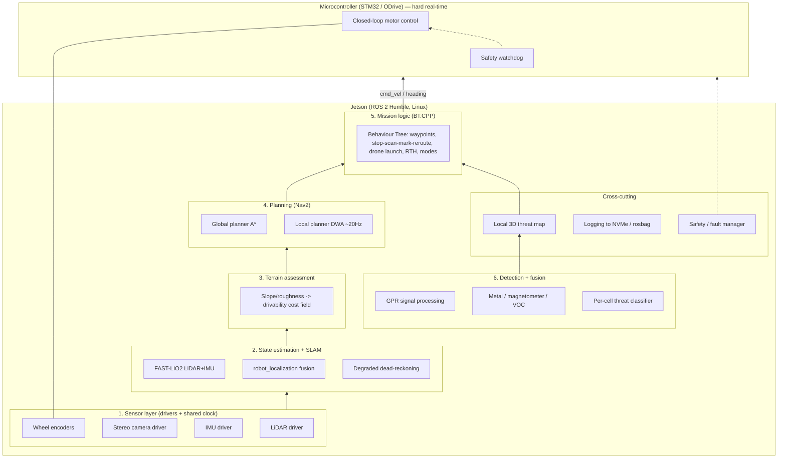
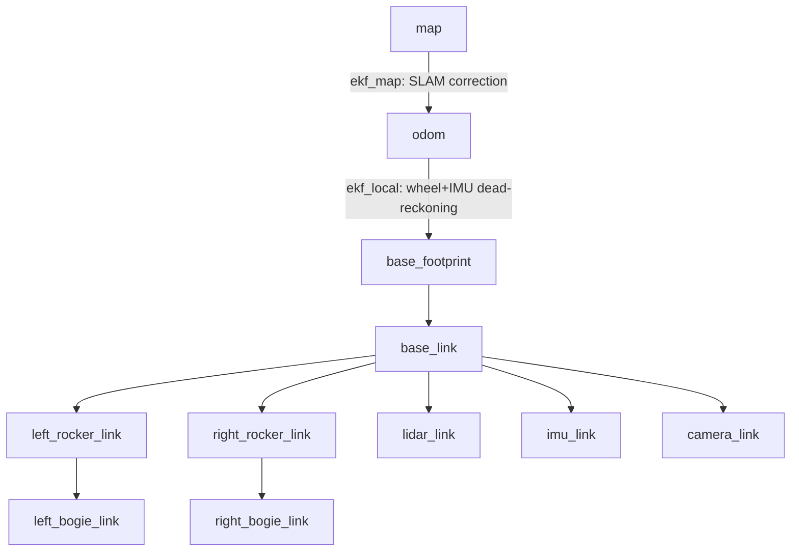

# System Architecture

The rover software is a layered ROS 2 stack. Time-critical control lives on a
microcontroller; all perception/planning/decision intelligence runs on the Jetson
under ROS 2 Humble. Everything is developed in Gazebo first.

## Layer responsibilities

| # | Layer | Package (planned) | Nature of work |
|---|-------|-------------------|----------------|
| 1 | Sensor drivers | `rover_description` (sim plugins) → real drivers later | Foundational plumbing; shared clock |
| 2 | State est + SLAM | `rover_localization` (FAST-LIO2 + robot_localization) | Integration easy, robustness in harsh terrain is hard |
| 3 | Terrain assessment | `rover_terrain` | Custom cost field from slope/roughness |
| 4 | Planning | `rover_navigation` (Nav2 config) | Config + plugins; A* global, DWA local |
| 5 | Mission logic | `rover_mission` (BT.CPP) | Your own code; modes + stop-scan-mark cycle |
| 6 | Detection + fusion | `rover_detection` | Research-heavy; FAR/m² metric; scarce labelled data |
| X | Safety / fault | `rover_safety` + MCU firmware | Watchdog, dropout, stall, e-stop, safe states |
| X | HW bridge | `rover_hw_bridge` | Serial/CAN to STM32/ODrive |
| X | Interfaces | `rover_msgs` | Custom msg/srv/action definitions |

## Key ROS 2 topics (sim, current)

| Topic | Type | Direction | Source |
|-------|------|-----------|--------|
| `/points` | `sensor_msgs/PointCloud2` | pub | LiDAR plugin |
| `/imu` | `sensor_msgs/Imu` | pub | IMU plugin |
| `/camera/image_raw` | `sensor_msgs/Image` | pub | Camera plugin |
| `/joint_states` | `sensor_msgs/JointState` | pub | Wheel encoders |
| `/odom` | `nav_msgs/Odometry` | pub | Diff-drive plugin |
| `/cmd_vel` | `geometry_msgs/Twist` | sub | Teleop / local planner |
| `/tf`, `/tf_static` | `tf2_msgs/TFMessage` | pub | State publishers |

## Operational modes (Mission layer, planned)

- **Standard** — normal supervised operation.
- **Autonomous** — full autonomy following mission + RoE.
- **Ghost** — zero RF emission.
- **Emergency Return** — abort and return home.
- **Lost-Comms-Autonomous** — continue mission autonomously without link.

## Development order (no hardware)

1. ✅ **Sim foundation** — URDF, Gazebo world, RViz (this increment).
2. ✅ **Localization/SLAM** — robot_localization dual-EKF (wheel+IMU local, SLAM
   global) + FAST-LIO2 integration + degraded dead-reckoning manager.
3. ✅ **Terrain cost layer** — point cloud → 2.5D elevation → slope/roughness
   drivability costmap (`/terrain/costmap`).
4. ✅ **Nav2** — global A* (NavFn) + local DWB @20Hz over the terrain costmap;
   confirmed threats → KeepoutFilter exclusion polygons that force a replan.
5. ✅ **Mission BTs** — BehaviorTree.CPP: waypoints, stop-scan-mark-reroute,
   drone launch on blind terrain, return-to-home, operational modes.
6. ✅ **Detection/fusion** — simulated GPR/metal/VOC, GPR hyperbola detection,
   per-cell fusion -> threat type + confidence, threat map + FAR/m² evaluation.
7. ✅ **Safety + HW bridge** — supervisory safety manager (watchdog, dropout/stall
   detection, e-stop, safe states) + Jetson<->MCU framed link + SITL MCU emulator
   + reference STM32 firmware.

## TF tree (with localization stack)

- `map -> odom` — published by `ekf_map` from the FAST-LIO2 SLAM pose (only when
  `slam:=true`). Absorbs long-term drift.
- `odom -> base_footprint` — published by `ekf_local` from wheel odometry + IMU;
  this is the continuous **dead-reckoning** estimate that survives LiDAR blackout.
- Everything below `base_link` comes from `robot_state_publisher` + `/joint_states`
  (including the passive rocker-bogie pivots).

## Localization topics (Phase 2)

| Topic | Type | Notes |
|-------|------|-------|
| `/odometry/filtered/local` | `nav_msgs/Odometry` | `ekf_local` output (odom frame) |
| `/odometry/filtered/global` | `nav_msgs/Odometry` | `ekf_map` output (map frame, SLAM) |
| `/fastlio/odometry` | `nav_msgs/Odometry` | FAST-LIO2 SLAM pose (remapped) |
| `/localization/mode` | `std_msgs/String` | `SLAM_HEALTHY` / `DEGRADED_DEAD_RECKONING` |
| `/localization/lidar_ok` | `std_msgs/Bool` | LiDAR throughput health flag |
| `/diagnostics` | `diagnostic_msgs/DiagnosticArray` | LiDAR-health diagnostic |

## Terrain topics (Phase 3)

| Topic | Type | Notes |
|-------|------|-------|
| `/terrain/costmap` | `nav_msgs/OccupancyGrid` | Drivability cost 0..100, -1 unknown (Nav2 input) |
| `/terrain/slope_deg` | `nav_msgs/OccupancyGrid` | Debug: per-cell slope (scaled 0..100) |
| `/terrain/roughness` | `nav_msgs/OccupancyGrid` | Debug: per-cell roughness/step (scaled 0..100) |

Cost fusion: `cost = max(slope_cost, roughness_cost)`, each a graded 0→100 ramp
between a *warn* and a *lethal* threshold; at/above lethal (tip-over slope or
unclimbable step) the cell is 100. This is what separates "steep but passable"
(finite cost the planner can pay) from "will tip you over" (lethal).

## Navigation topics/interfaces (Phase 4)

| Topic / interface | Type | Notes |
|-------------------|------|-------|
| `/goal_pose` | `geometry_msgs/PoseStamped` | Single navigation goal (RViz Nav2 Goal) |
| `/plan` | `nav_msgs/Path` | Global A* route |
| `/cmd_vel` | `geometry_msgs/Twist` | DWB output -> Gazebo diff-drive |
| `/global_costmap/costmap` | `nav_msgs/OccupancyGrid` | Global costmap (terrain + inflation + keepout) |
| `/local_costmap/costmap` | `nav_msgs/OccupancyGrid` | Rolling local costmap |
| `/threat/add_zone` | `geometry_msgs/PolygonStamped` | Add a confirmed-threat exclusion polygon |
| `/threat/clear` | `std_srvs/Empty` | Remove all exclusion zones |
| `/keepout_filter_mask` | `nav_msgs/OccupancyGrid` | Rasterised keepout mask (latched) |
| `/costmap_filter_info` | `nav2_msgs/CostmapFilterInfo` | KeepoutFilter metadata |

Threat reroute mechanism: `threat_zone_node` rasterises confirmed-threat polygons
into the keepout mask; Nav2's `KeepoutFilter` marks those cells lethal in both
costmaps, invalidating any crossing path and forcing the A* planner to reroute.

## Mission topics/interfaces (Phase 5)

| Topic / interface | Type | Notes |
|-------------------|------|-------|
| `/detection/threat` | `geometry_msgs/PointStamped` | Confirmed threat location (from Phase 6) |
| `/mission/mode` | `std_msgs/String` | Set operational mode |
| `/mission/status` | `std_msgs/String` | Telemetry (suppressed in Ghost mode) |
| `/drone/launch` | `std_msgs/Empty` | Drone-launch trigger (blind terrain) |
| `/threat/add_zone` | `geometry_msgs/PolygonStamped` | MarkThreat -> keepout (to Phase 4) |
| `/navigate_to_pose` | `nav2_msgs/action/NavigateToPose` | Mission -> Nav2 goals |

The mission tree ([bt/mission.xml](../rover_ws/src/rover_mission/bt/mission.xml)) is a
top-level Fallback: an EmergencyReturn override branch, then a ReactiveSequence that
each cycle handles threats (Stop -> Mark -> Clear), blind terrain (LaunchDrone), and
waypoint driving (GetNextWaypoint -> NavigateToPose -> ClearGoalFlag; ReturnToHome
when the queue empties). Custom BT nodes live in `rover_mission/src/bt_nodes.cpp`.

## Detection/fusion topics (Phase 6)

| Topic | Type | Notes |
|-------|------|-------|
| `/gpr/scan` | `rover_msgs/GprScan` | Simulated GPR A-scan (amplitude vs depth) |
| `/sensors/reading` | `rover_msgs/SensorReading` | Processed gpr/metal/voc anomalies |
| `/detection/confidence` | `nav_msgs/OccupancyGrid` | Fused per-cell confidence (RViz) |
| `/detection/threat` | `geometry_msgs/PointStamped` | Confirmed threat -> mission layer |
| `/detection/threats` | `rover_msgs/ThreatDetection` | Classified detection (type + confidence) |
| `/detection/metrics` | `std_msgs/String` | Pd and false-alarm-rate per m² |

Pipeline: `sensor_sim_node` (ground truth -> raw sensors) -> `gpr_processor_node`
(background subtraction + hyperbola-apex detection) + metal/VOC anomalies ->
`fusion_node` (per-cell logistic fusion, persistence + multi-sensor gate to keep
FAR/m² low, threat-map JSONL log) -> `/detection/threat`. `detection_eval_node`
scores Pd and FAR/m² against ground truth. This is the least-solved, most
research-heavy layer; the sim provides labelled data the real system lacks.

## Safety + hardware bridge topics (Phase 7)

| Topic / interface | Type | Notes |
|-------------------|------|-------|
| `/cmd_vel` | `geometry_msgs/Twist` | High-level command (Nav2 / mission / teleop) |
| `/cmd_vel_safe` | `geometry_msgs/Twist` | Safety-gated command -> bridge |
| `/safety/state` | `std_msgs/String` | NOMINAL / DEGRADED / SAFE_STOP / ESTOP |
| `/safety/estop` | `std_msgs/Bool` | Assert emergency stop (latches) |
| `/safety/reset` | `std_srvs/Trigger` | Clear a latched E-STOP |
| `/mcu/rx`, `/mcu/tx` | `std_msgs/UInt8MultiArray` | SITL stand-in for the serial/CAN wire |
| `/mcu/heartbeat` | `std_msgs/Empty` | MCU liveness (fed to the watchdog) |
| `/mcu/feedback` | `sensor_msgs/JointState` | Wheel speeds + current from the MCU |
| `/mcu/fault` | `std_msgs/UInt8` | MCU fault bitmask |
| `/motor/cmd_vel` | `geometry_msgs/Twist` | MCU output -> Gazebo motors |

Command path with the hardware stack:
`Nav2/mission -> /cmd_vel -> safety_manager -> /cmd_vel_safe -> hw_bridge ->
(framed link /mcu/rx) -> mcu_sim -> /motor/cmd_vel -> Gazebo`. The MCU runs an
INDEPENDENT watchdog: if command frames stop (Jetson/safety/link failure) it
forces the motors to zero within ~200 ms. Both the supervisory safety states and
the MCU-level watchdog converge on the same guaranteed safe state (zero velocity).
Reference firmware: `rover_hw_bridge/firmware/stm32`.
